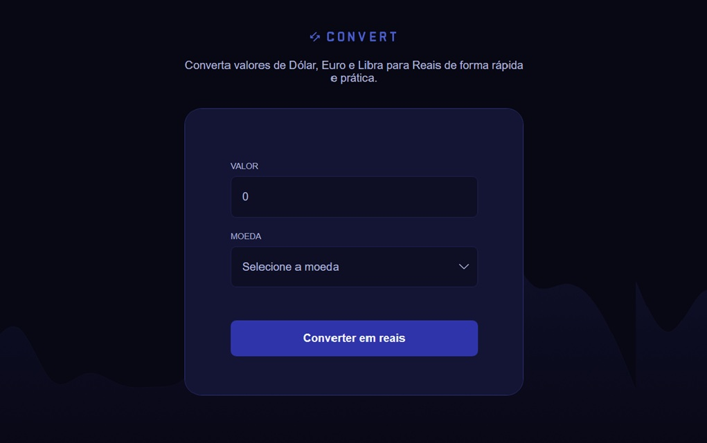

# 💱 Convert



O **Convert** é um conversor de moedas simples, desenvolvido com **HTML, CSS e JavaScript**, criado com o objetivo de praticar conceitos fundamentais da programação e da manipulação do DOM.

A ideia é bem direta: o usuário digita um valor e escolhe as moedas, e o app mostra o resultado da conversão.  
As taxas de câmbio são fixas, apenas para fins de aprendizado e teste.

---

## ⚙️ Tecnologias utilizadas

- **HTML5** – estrutura da aplicação  
- **CSS3** – estilização e responsividade  
- **JavaScript (ES6+)** – lógica principal e manipulação dos elementos na tela  

---

## 💡 O que aprendi com esse projeto

Esse projeto me ajudou a entender melhor como:
- Trabalhar com **funções e eventos** no JavaScript;  
- Manipular elementos com **`textContent` e `querySelector`**;  
- Estruturar um código simples e funcional;  
- Pensar de forma mais lógica e organizada durante o desenvolvimento.  

Mesmo sendo um projeto básico, serviu pra reforçar conceitos e perceber o quanto é importante colocar a mão no código todos os dias.

---

## 🚀 Como rodar o projeto

1. Faça o clone do repositório:
   ```bash
   git clone https://github.com/Andersondev123/convert.git

2. Acesse a pasta do projeto:

cd convert


3. Abra o arquivo index.html diretamente no navegador.

Pronto! 🎉